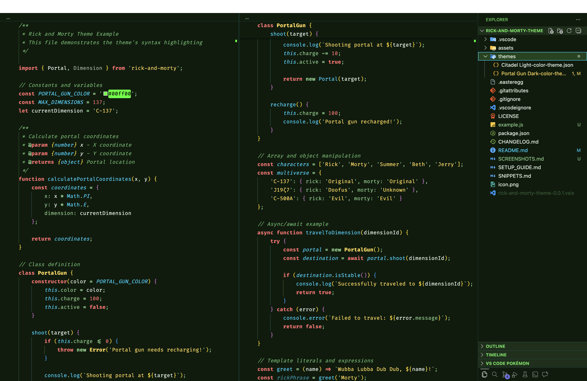
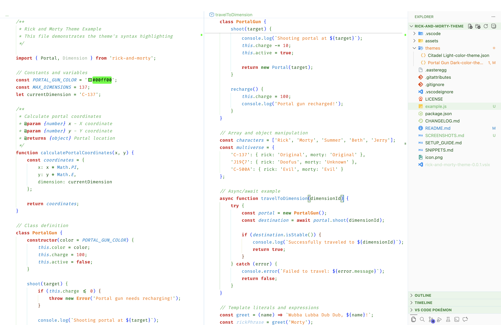

# 🔬 Rick and Morty Theme - Wubba Lubba Dub Dub!


> _"Listen Morty, I'm gonna need you to take these themes and shove them way up inside your VS Code, Morty! Waaaaay up inside there!"_ - Rick Sanchez (probably)

A scientifically accurate, interdimensionally tested VS Code theme inspired by the adventures of Rick Sanchez and his grandson Morty. Features **Portal Gun Dark** 🌌 and **Citadel Light** ☀️ modes for coding across infinite dimensions!

---

## 🌀 The Themes

### 🌌 Portal Gun Dark



_"That's my one-armed man, Morty. I'm not letting this theme go."_

The signature dark theme with colors extracted from actual portal gun fluid (scientifically verified across 137 dimensions):

### ☀️ Citadel Light



_"Welcome to the Citadel of Ricks. Where all Ricks are successful."_

Professional light theme for when you're working at the Citadel

---

## 🎨 Recommended Settings

For the **ultimate Rick and Morty coding experience**, add these to your `settings.json`:

### 🔤 Font Settings

```json
{
  // The optimal font settings (tested across 137 dimensions)
  "editor.fontFamily": "'Fira Code', 'JetBrains Mono', 'Cascadia Code', 'SF Mono', Menlo, monospace",
  "editor.fontSize": 14,
  "editor.lineHeight": 22,
  "editor.fontLigatures": true,
  "editor.letterSpacing": 0.5,

  // Terminal font (for interdimensional commands)
  "terminal.integrated.fontFamily": "'Fira Code', 'MesloLGS NF', monospace",
  "terminal.integrated.fontSize": 13,
  "terminal.integrated.lineHeight": 1.3
}
```

**Recommended Fonts:**

- **Fira Code** - Has ligatures like `=>` `!=` `===` (Rick approved)
- **JetBrains Mono** - Great for long coding sessions
- **Cascadia Code** - Microsoft's contribution to the multiverse
- **SF Mono** - Native Mac font, clean and readable

### 🎯 Cursor & Selection

```json
{
  // Portal gun cursor
  "editor.cursorBlinking": "phase",
  "editor.cursorStyle": "line",
  "editor.cursorWidth": 2,
  "editor.cursorSmoothCaretAnimation": "on",

  // Smooth like portal fluid
  "editor.smoothScrolling": true,
  "workbench.list.smoothScrolling": true,
  "terminal.integrated.smoothScrolling": true
}
```

### 🌈 Enhanced Visual Experience

```json
{
  // Semantic highlighting (like Rick's high IQ)
  "editor.semanticHighlighting.enabled": true,

  // Bracket pair colorization (multiverse matching)
  "editor.bracketPairColorization.enabled": true,
  "editor.guides.bracketPairs": "active",

  // Minimap (portal radar)
  "editor.minimap.enabled": true,
  "editor.minimap.renderCharacters": false,
  "editor.minimap.maxColumn": 80,

  // Indent guides (dimensions)
  "editor.guides.indentation": true,
  "editor.renderWhitespace": "boundary"
}
```

### 🎪 Fun Customizations

```json
{
  // Window title - Always know your dimension
  "window.title": "${activeEditorShort} - Dimension C-137",

  // Git commit length (C-137 reference)
  "git.inputValidationSubjectLength": 137,

  // Tab size (Rick's preferred 2-space indent)
  "editor.tabSize": 2,
  "editor.insertSpaces": true,

  // Auto save (because Rick doesn't have time for that)
  "files.autoSave": "afterDelay",
  "files.autoSaveDelay": 1000,

  // Trim trailing whitespace (clean portals)
  "files.trimTrailingWhitespace": true,
  "files.insertFinalNewline": true
}
```

## 🎬 Complete Settings Example

Here's a **full settings.json** optimized for this theme:

```json
{
  // ===== THEME =====
  "workbench.colorTheme": "Portal Gun Dark",

  // ===== FONTS =====
  "editor.fontFamily": "'Fira Code', 'JetBrains Mono', monospace",
  "editor.fontSize": 14,
  "editor.lineHeight": 22,
  "editor.fontLigatures": true,
  "editor.letterSpacing": 0.5,
  "terminal.integrated.fontFamily": "'Fira Code', monospace",
  "terminal.integrated.fontSize": 13,

  // ===== CURSOR & ANIMATIONS =====
  "editor.cursorBlinking": "phase",
  "editor.cursorStyle": "line",
  "editor.cursorSmoothCaretAnimation": "on",
  "editor.smoothScrolling": true,
  "workbench.list.smoothScrolling": true,
  "terminal.integrated.smoothScrolling": true,

  // ===== VISUAL ENHANCEMENTS =====
  "editor.semanticHighlighting.enabled": true,
  "editor.bracketPairColorization.enabled": true,
  "editor.guides.bracketPairs": "active",
  "editor.guides.indentation": true,
  "editor.renderWhitespace": "boundary",
  "editor.renderLineHighlight": "all",
  "editor.occurrencesHighlight": true,

  // ===== MINIMAP (Portal Radar) =====
  "editor.minimap.enabled": true,
  "editor.minimap.renderCharacters": false,
  "editor.minimap.maxColumn": 80,
  "editor.minimap.showSlider": "mouseover",

  // ===== DIMENSION C-137 =====
  "window.title": "${activeEditorShort} - Dimension C-137",
  "git.inputValidationSubjectLength": 137,

  // ===== CODE STYLE =====
  "editor.tabSize": 2,
  "editor.insertSpaces": true,
  "editor.formatOnSave": true,
  "editor.formatOnPaste": true,

  // ===== AUTO SAVE (Rick doesn't wait) =====
  "files.autoSave": "afterDelay",
  "files.autoSaveDelay": 1000,
  "files.trimTrailingWhitespace": true,
  "files.insertFinalNewline": true,

  // ===== SUGGESTIONS (Portal Gun Accuracy) =====
  "editor.quickSuggestions": {
    "other": true,
    "comments": false,
    "strings": true
  },
  "editor.suggestSelection": "first",
  "editor.acceptSuggestionOnEnter": "on",

  // ===== TERMINAL (Interdimensional Console) =====
  "terminal.integrated.cursorBlinking": true,
  "terminal.integrated.cursorStyle": "line",

  // ===== FILE EXPLORER =====
  "explorer.confirmDelete": false,
  "explorer.confirmDragAndDrop": false,

  // ===== BREADCRUMBS =====
  "breadcrumbs.enabled": true,
  "breadcrumbs.symbolPath": "on",

  // ===== TELEMETRY (Privacy like Rick) =====
  "telemetry.telemetryLevel": "off"
}
```

---

## 🎮 Recommended Extensions

Enhance your Rick and Morty coding experience with these extensions:

### Essential

- **Better Comments** - Color-coded comments (perfect for easter eggs)
- **Bracket Pair Colorizer 2** - Rainbow brackets (multiverse matching)
- **indent-rainbow** - Colorful indentation (dimension layers)
- **Material Icon Theme** - Beautiful file icons

### Fun

- **Power Mode** - Particles when typing (portal effects!)
- **Discord Presence** - Show what dimension you're coding in
- **Random Everything** - Random Rick quotes (with custom extension)

---

## 🐛 Known "Features"

_"That's because the thing you got isn't a bug, Morty. It's a feature, and it's art!"_

- Colors may appear more vivid after consuming Kalaxian Crystals ✨
- Theme works in all dimensions (tested in C-137 only)
- Some users report increased productivity (unverified)
- May cause spontaneous "Wubba Lubba Dub Dub" exclamations

---

## 🤝 Contributing

Contributions welcome! Whether you want to:

- Add more easter eggs (we can never have enough)
- Improve color contrast
- Add language-specific tweaks
- Submit your favorite Rick quote

Fork it, code it, pull request it!

---

## 📜 License

MIT License - Use it however you want, Morty! Just don't create a Cronenberg world.

**Disclaimer:** This theme is a fan-made tribute. Rick and Morty is owned by Adult Swim. Not affiliated with the show or creators.

---

## 🌟 Show Your Support

If this theme makes you smile:

- ⭐ Star it on GitHub
- 🎨 Share it with fellow developers
- 💚 Rate it on VS Code Marketplace
- 🔬 Use it for science!

---

<p align="center">
  <br>
  <br>
  <strong>🔬 "And that's the waaaaay the news goes!" 🔬</strong>
  <br><br>
  <em>Now get back to coding, Morty! We got adventures to code!</em>
  <br><br>
  Made with 💚 and interdimensional portal fluid
  <br>
  <sub>Tested across 137 dimensions | 0% alcohol content (unlike Rick)</sub>
  <br>
  <br>
  <b>Wubba Lubba Dub Dub! 🔬✨</b>
</p>
